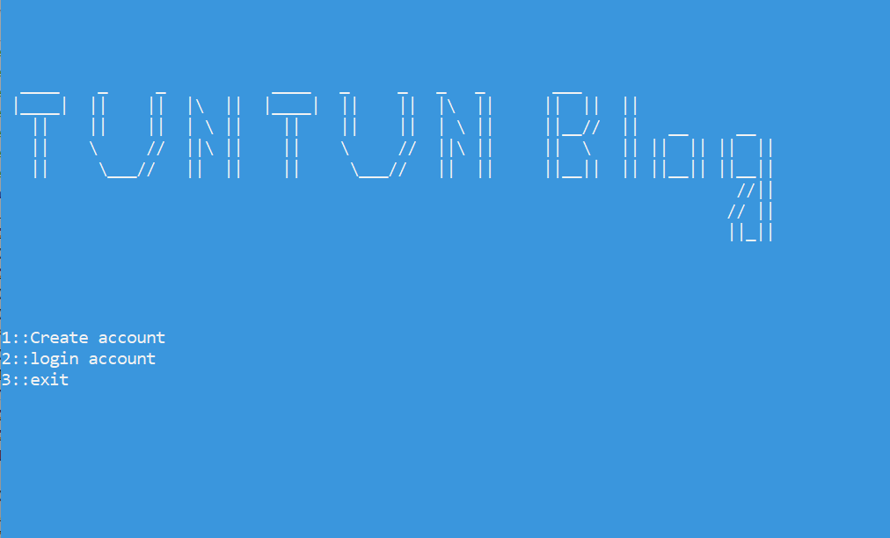
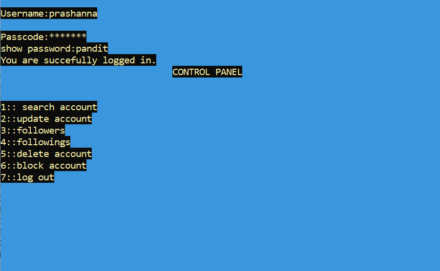

# TunTun Blog

The project titled 'Tun Tun Blog' is a program which enables a user to share its blogs and writings to their followers. They can also view posts shared by their friends on Tun Tun Blog. Anyone can create an account by registering an email address, selecting a username and date of birth.

## Features

- Search Account
- Follow Account
- Unfollow Account
- Delete Account
- Update Account

To login in one's account one should provide a registered username with password. After login, the control panel or main menu appears. In the control panel, there are features like  ‘search account’ where users can search userID and follow userID, update account where user can change their existing password, unfollow account to unfollow an user, delete account to delete account permanently and following and follower icon to see the followings and followers. At last there is an option to log out from where users can sign out from the program and back to the main menu.

## Methodology
In this project we have used graph data structures.
A graph is a non-linear data structure. A graph can be defined as a collection of Nodes which are also called “vertices” and “edges” that connect two or more vertices. A graph can also be seen as a cyclic tree where vertices do not have a parent-child relationship but maintain a complex relationship among them.

